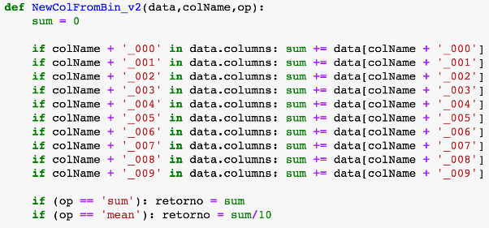
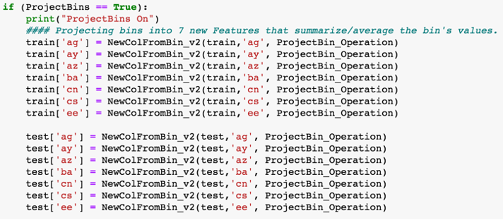
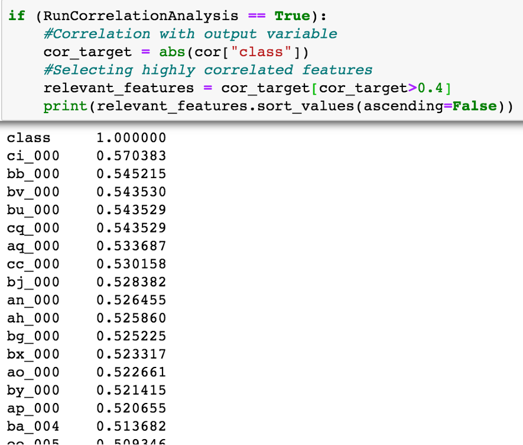
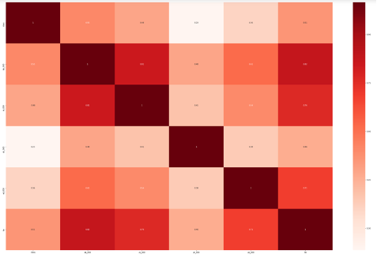
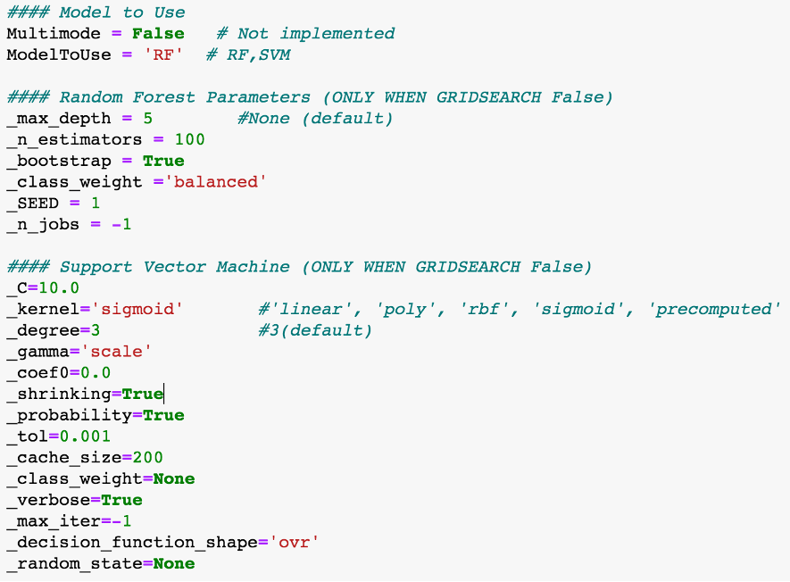
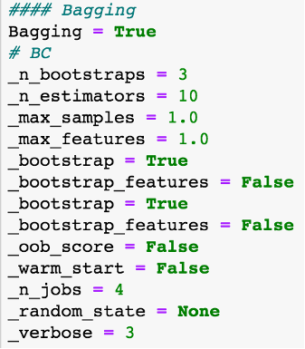
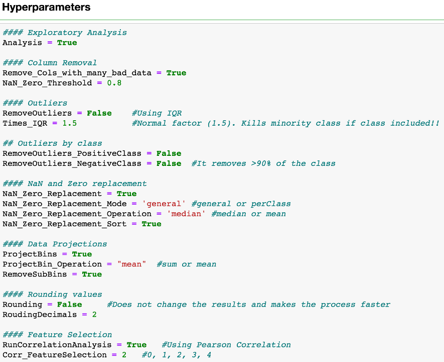
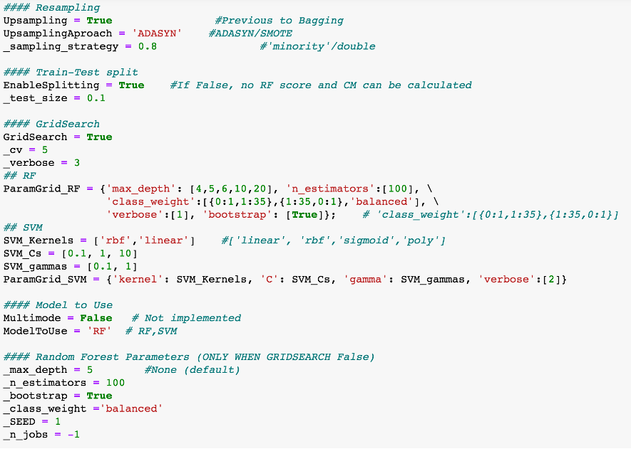
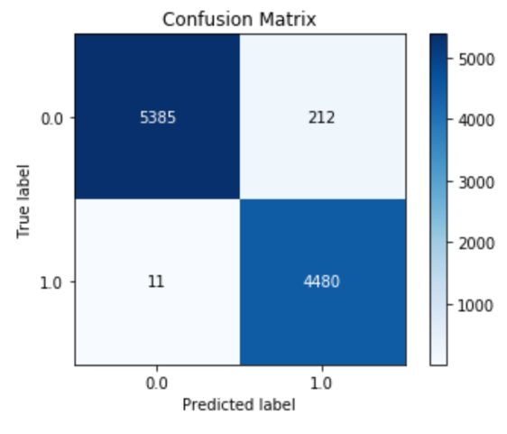

# **Data Mining and Machine Learning Project** - Python, Scikit-learn and APS Failure at Scania Trucks Data Set
by Javier Rico (jvirico@gmail.com)

### **PROBLEM DEFINITION**

The goal is to minimize maintenance costs of the air pressure system (APS) of Scania trucks. Therefore, failures should be predicted before they occur. Falsely predicting a failure has a cost of 100, missing a failure has a cost of 3500. This leads to the need to cost minimization.

### **IMPLEMENTATION AND PROCESS**

Python 3, Jupyter Notebook and Scikit-learn Machine Learning library have been used to approach this binary classification challenge.

The implementation has a HYPERPARAMETERs section at the beginning to turn on and off almost all decisions considered in the process.

_**IMPORTANT**_: Note that not all transformations and techniques explained in this document have been applied to the final solution, but many will be explained to expose the process followed. Each solution uploaded to Kaggle competition has the hyperparameters used informed in its description, random seeds, when used, are also informed there.

---

The process followed has been an iteration of different combinations of the steps listed below. Those steps that resulted in improvements have been consistently used, these are explained in the _Conclusions_ and _Notes_ below each section:

- **Data Analysis/Discovery**
  - Data types of features
  - Feature Class imbalance
  - Dataset Statistics
  - Outliers
  - NaN and zero analysis

- **Data Preparation/Cleansing**
  - Feature Class to 0-1 values
  - Removing Outliers using Interquartile Ranges (IQR)
  - NaNs and Zeros
  - Removing Features with number of NaNs and Zeros above Threshold
  - Replacing NaNs and Zeros
  - Projections
    - Projecting Bins into 7 new features
  - Feature Selection
    - Removing SubBins
    - High Intercorrelated Features
    - Top correlated features with Class
  - Sampling
    - Up-sampling minority class

- **Model selection**
  - Random Forest
  - Support Vector Machine
  - Bagging

- **Parameter tuning**
  - GridSearch
  - MakeScorer
  - Hyperparameters section

- **Training the model**
  - Favor True class (post processing)

- **Evaluating the model**

- **Prediction**

- **Summary of methods**

---
### **DATA ANALYSIS / DISCOVERY**

The data consists of a training set with 60000 rows, of which 1000 belong to the positive class, and 171 columns, of which one is the Class column. All the attributes are numeric, except Class that is a Boolean.

- Data types of features
- Dataset Statistics
- Feature Class imbalance
- Outliers
- NaN and Zero analysis

**Data types of features**

### Conclusions:

---

All features are numeric values.
---

**Dataset Statistics**

### Conclusions:

---

There are features with up to 81% of missing values (0&#39;s and NaNs). Almost all features have sparse NaNs and 0s.

---

**Feature Class imbalance**

### Conclusions:
---
The &#39;class&#39; feature, also the target attribute for our model, is highly imbalanced.

Some approaches that have been tried:

- As it is.
- Up-sampling using **SMOTE** or **ADASYN** to obtain same samples of each class (balanced 50/50).
- Up-sampling using SMOTE or ADASYN using different ratios for True/False samples (example: sampling\_strategy = 0.8).

These strategies directly affect the final score since False Positives have different penalty than False Negatives. To deal with this the following approaches have been tried:

- Scikit-learn **Make Scorer** (sklearn.metrics.make\_scorer) have been used in conjunction with GridSearch to favor models with better scores. For this, a custom GetScore function has been coded to fit our case.

- When Random Forest has been used, different weights have been set up for True and False classes (example: class\_weight={0:1,1:35}).
---
**Outliers (all features)**

Outliers (Trues profile vs Falses profile)

### Conclusions:
---
Many of the features contain outliers.

IQR - **Interquartile Range Rule** has been used to remove them:

  - with 1.5 times the third quartile has been used.
  - Different thresholds (greater than 1.5x 3rt quartile) have been tried.
  - When removed Outliers using 1.5 IQR, True class has been removed when the dataset is not balanced (ex. up-sampled). IQR on True sub set and IQR on False sub set has been also tried, but this cannot be replicated in Test dataset so it has been discarded.
  - Not removing outliers. In many cases removing Outliers did not lead to better results.
---

**NaN and zero analysis**

Almost all features have sparse NaNs and Zeros.

### Conclusions:
---

There are features with up to 81% of missing values (0&#39;s and NaNs).

Removing columns with more than _Threshold_ of missing values has been tried.

Most of the times 0.8 has shown good results, as shown above, this setting gets rid of 42 features.

For the rest of NaNs and 0s, replacement (mean/median) has been performed. For NaNs an imputation algorithm has been used (_sklearn.preprocessing.**imputer**_).

---
### **DATA PREPARATION / CLEANSING**

Transformations used:

- Feature Class to 0-1 values
- Removing Outliers using Interquartile Ranges (IQR)
- NaNs and Zeros
- Removing Features with number of NaNs and Zeros above Threshold
- Replacing NaNs and Zeros
- Projections
  - Projecting Bins into 7 new features
- Feature Selection
  - Removing SubBins
  - High Intercorrelated Features
  - Top correlated features with Class
- Sampling
  - Up-sampling minority class

**Feature Class to 0-1 values**

### Note:
---

Applied always.

---
**Removing Outliers using Interquartile Ranges (IQR)**

Many of the features contain outliers.

IQR - Interquartile Range Rule has been used to remove outliers:

- with 1.5 times the third quartile has been used.
- Different thresholds (greater than 1.5x 3rt quartile) have been tried.
- When removed Outliers using 1.5 IQR, True class has been removed when the dataset is not balanced (ex. up-sampled). IQR on True sub set and IQR on False sub set has been also tried. This cannot be replicated in Test dataset so it has been discarded.
- Not removing outliers.

### Note:
---

In many cases removing Outliers did not lead to better results.

---

**NaNs and Zeros**

There are features with up to 81% of missing values (0&#39;s and NaNs). And almost all features have sparse NaNs and Zeros.

1. Removing columns with more than _Threshold_ of missing values has been tried.

Most of the times 0.8 has shown good results.

2. For the rest of NaNs and 0s, replacement (mean/median) has been performed.

### Note:

---

1. Applied in the majority of trials with threshold = 0.8.
2. Applied always, replacing with mean value most of the times. For this an imputation of missing values using _sklearn.preprocessing.__ **imputer** _ has been performed.

---

**Projections**

Projecting Bins (histograms) into 7 new features:

- Substitution of the bins for 7 new features, either summarizing or averaging, showed an improvement. The seven new features are highly correlated with the original bins so removing them simplifies the dataset.

- When this is applied, we assume the loss of the distributions of the original bins as histograms of the original attributes.

### Note:
---

Bins projections on 7 new attributes and deletion of original histograms has been applied for most of the trials.

---

**Feature Selection / Correlation / Ranking**

Removing histograms:

Bins projections on 7 new attributes and deletion of original histograms has been applied for most of the trials.

High Intercorrelated Features:

Feature correlation using Pearson&#39;s Correlation has been performed.

The data has a lot of features, because of that, is very difficult to visualize hierarchical graphs. We use a table instead.

Top correlated features with Class:

Feature ranking is made based on top feature correlations with Class attribute.

Several feature sub sets are selected based on top correlated ranking.

(After Feature Selection)

Corr\_FeatureSelection = 1

Corr\_FeatureSelection = 2

### Note:

---

Best results have been achieved with Corr\_FeatureSelection = 1.

---

**Sampling**

The &#39;class&#39; feature, also the target attribute for our model, is highly imbalanced.

Some approaches that have been tried:

- As it is.
- Up-sampling using SMOTE or ADASYN to obtain same samples of each class (balanced 50/50).
- Up-sampling using SMOTE or ADASYN using different ratios for True/False samples (example: sampling\_strategy = 0.8).

### SMOTE and ADASYN:
---

**SMOTE** : Synthetic Minority Over Sampling Technique (SMOTE) algorithm applies KNN approach where it selects K nearest neighbors, joins them and creates the synthetic samples in the space. The algorithm takes the feature vectors and its nearest neighbors, computes the distance between these vectors. The difference is multiplied by random number between (0, 1) and it is added back to feature. SMOTE algorithm is a pioneer algorithm and many other algorithms are derived from SMOTE.

**ADASYN** : ADAptive SYNthetic (ADASYN) is based on the idea of adaptively generating minority data samples according to their distributions using K nearest neighbor. The algorithm adaptively updates the distribution and there are no assumptions made for the underlying distribution of the data. The algorithm uses Euclidean distance for KNN Algorithm. The key difference between ADASYN and SMOTE is that the former uses a density distribution, as a criterion to automatically decide the number of synthetic samples that must be generated for each minority sample by adaptively changing the weights of the different minority samples to compensate for the skewed distributions. The latter generates the same number of synthetic samples for each original minority sample.

---

### Notes:

---

ADASYN has shown better results than SMOTE. It has been used most of the time.

Resampling strategies directly affect the final score since False Positives have different penalty than False Negatives. To deal with this the following approaches have been tried:

- Scikit-learn Make Scorer (sklearn.metrics.make\_scorer) have been used in conjunction with GridSearch to favor models with better scores. For this, a custom GetScore function has been coded to fit our case.

- When Random Forest has been used, different weights have been set up for True and False classes (example: class\_weight={0:1,1:35}).

---

### **MODEL SELECTION**

Model selection, ensemble learning.

Two main algorithms have been considered, Support Vector Machine and Random Forest. GridSearch has been used to try different configurations on both.

Bagging has been also used as ensemble learning technique, usually with 10 estimators.

Support Vector Machine

### Notes:

---

SVM has shown to be much more computationally expensive compared with the rest of techniques used. In particular, GridSearch + SVM + Bagging has been almost impossible to achieve with a personal computer due to the time needed to train it.

---

Random Forest:

### Notes:
---
Since False Positives have different penalty than False Negatives, when Random Forest has been used, different weights have been set up for True and False classes (example: class\_weight={0:1,1:35}).

Pruning on Random Forest using _max\_depth_ has been performed to avoid overfitting. First trials achieved 0.99 accuracy and bad results on Kaggle competition. Once max\_depth was properly set overall results were achieved. Pruning has been observed to be sensible to feature selection and resampling, requiring adaptation after such changes.

---

Bagging:

### Notes:
---
Bagging has shown small but consistent improvements in many configurations. Decreasing the number of estimators below 10 has shown bad results.

---

### **PARAMETER TUNING**

GridSearch:

GridSearch has been used to try different configurations on both, RF and SVM.

### Notes:

---
Scikit-learn Make Scorer (sklearn.metrics.make\_scorer) has been used in conjunction with GridSearch to favor models with better scores. For this, a custom GetScore function has been coded to fit our case.

---

Hyperparameters section:

Main parameters of the implementation are located at the beginning of the Jupyter Notebook to facilitate an iterative training using different strategies.

### **TRAINING THE MODEL**

Two options before and after finally training the model have been used to try to improve the result.

1. Change the train-test dataset split. Usually preformed with 80/20 or 90/10 when full up-sampling.

2. &#39;Favor True class&#39;, after training the model.

When FavorTrueClass = True, all False predictions very close to 50% probability are switched to True class (a threshold is used, usually set to \&lt; 0.45).

Meaning that those predictions very close to random are set to True with the aim to favor the score, and avoid some False Negative penalties.

### Notes:
---
1. Train-Test splits have always been performed using **stratification**.

---
### **EVALUATING THE MODEL**

Model accuracy, confusion Matrix, and score, are the measures used to evaluate the results.

Confusion Matrix example:

Accuracy example:

Score example:

### **PREDICTION**

All data transformations, cleansing, feature selection, projections, except for resampling, are applied to the Test dataset. Those operations that could not be replicated in the Test dataset have been avoided.

Recently trained model is used to predict the Test dataset Class feature. Good results, or sometimes just very different approaches, are uploaded to Kaggle challenge.

Every Kaggle upload has in its description the hyperparameters used, to replicate any upload the only thing needed is to set those options and run it again. Random seeds, when used, are also informed in the description.

---

### **SUMMARY OF METHODS**

- imblearn.over\_sampling. **SMOTE** (resampling)
- imblearn.over\_sampling. **ADASYN** (resampling)
- sklearn.impute. **Imputer** (NaNs imputation)
- sklearn.ensemble. **RandomForestClassifier** (classification)
- sklearn.svm. **SVC** (classification)
- sklearn.metrics. **make\_scorer** (custom score)
- sklearn.model\_selection. **GridSearchCV** (model parametrization)
- sklearn.ensemble. **BaggingClassifier** (model ensemble)
- **Pearson&#39;s Correlation** (feature correlation analysis)
- **Stratification** when splitting Train-Test datasets
- **Bootstraping** option for models when possible
- Interquartile Range Rule ( **IQR** ) for Outlier identification

## Cite this work
    J. Rico, (2019) DM and ML - Scania Trucks Failure prediction
    [Source code](https://github.com/jvirico/ScaniaTruckFailurePrediction)
